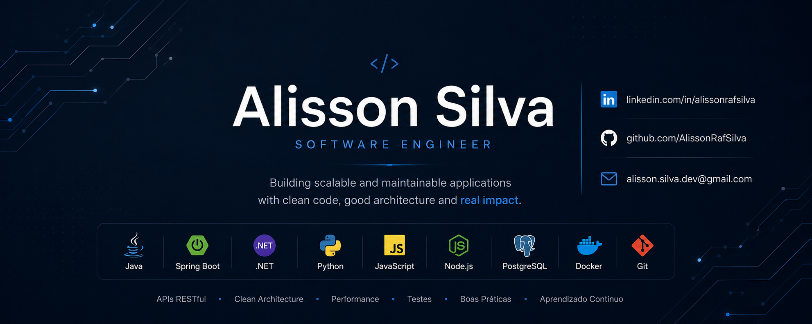

  

# 👋 Olá, eu sou o Alisson Silva

🎯 Desenvolvedor Full Stack Júnior em formação, com foco em Back-end, APIs REST e soluções práticas.

Atualmente estou aprofundando meus estudos em Java, Spring Boot, Node.js, bancos de dados e desenvolvimento de APIs, buscando minha primeira oportunidade na área de tecnologia.

---

## 🚀 Sobre mim

- 💻 Foco em desenvolvimento Back-end e Full Stack
- ☕ Experiência prática com Java e Spring Boot
- 🔗 Desenvolvimento de APIs REST
- 🗄️ Banco de dados com PostgreSQL e MySQL
- 🧠 Em evolução constante com projetos práticos
- 📍 Brasil | Aberto a oportunidades remotas

---

## 🛠️ Tecnologias

Java • Spring Boot • JavaScript • Node.js • HTML • CSS • PostgreSQL • MySQL • Git • GitHub • APIs REST

---

## 📌 Projetos em destaque

### 🐾 VetFinder Backend
API backend para uma plataforma que conecta clínicas veterinárias a profissionais volantes.

### 🚗 AdaRent
Projeto prático desenvolvido durante estudos, aplicando lógica, estruturação de código e organização de funcionalidades.

### 💰 Conversor de Moedas
Projeto para praticar lógica de programação, entrada de dados e regras de conversão.

---

## 📫 Contato

[LinkedIn](https://www.linkedin.com/in/alissonrafsilva/)  
Email: alissonrafsilva@gmail.com
